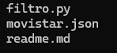

# Movistar

Esta página de movistar es para ingresar usuarios.

## Descripción

La página esta enfocada en ingresar usuarios a una base de datos:
1. Ingresar usuarios con nombre, apellido, dirección y número celular.
2. Leer información del usuario la cual nos arroja una información del usuario hallada en una base de datos.
3. Nos arroja también un espacio donde el usuario podra ver el plan que obtuvo.

## Tecnologías utlizadas

* Python

## Estructura del proyecto

 Aquí podras observar lo utilizado para desarrollar el proyecto:

 

 Al inicio podras encontrar los archivos [filtro.py], [movistar.json] y [readme.md].

## Carateristícas
* Archivos [filtro.py]:El cual contiene todo el código principal del proyecto.
* Archivo [movistar.json]:El cual contiene los recursos necesarios para desarrollar el proyecto.
* Archivo [readme]:El cual contiene toda la información relevante realizada en el código.

## Diseño

* El diseño se hizo de la manera más facil posible para que cualquier usuario al abrirla la pueda entender.
* El código se desarrollo en únion con el json.

## Instrucciones
1. Clonar el repositorio cargado en GitHub.
2. Abrir en la nube el archivo de HTML.

## Desarrollado por

El proyecto fue realizado por Yessica Andrea Perez Machuca estudiante de Campuslands como trabajo de proyecto de filtro para el módulo de Python.